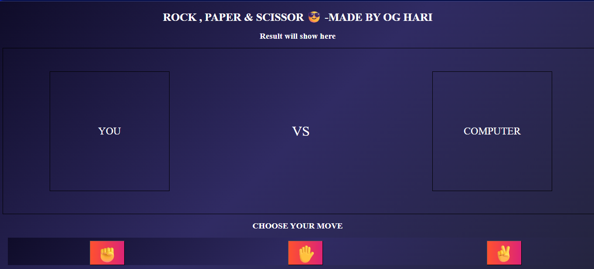

# 🪨 Rock Paper Scissors Game ✂️

This is a simple **Rock, Paper & Scissors** game built using **HTML**, **CSS**, and **JavaScript**.  
It features smooth UI, emoji-based moves, result animations, and a cool dark theme interface.

---

## 💻 Features

- Choose between ✊ Rock, ✋ Paper, ✌️ Scissors
- Random computer move every round
- Result display with:
  - 🎉 Sparkle animation on win
  - 😢 Sad fade on loss
- Live emoji display for your and computer's move
- Fully responsive and styled UI

---

## 📸 Preview

Here is how the UI looks:

---

## 🛠️ Technologies Used

- **HTML5**
- **CSS3** (animations, flexbox, gradients)
- **JavaScript (Vanilla)** — no frameworks used

---

## 🚀 How to Run

1. Clone or download this repository
2. Open the file `index.html` (or `rock_paper_scissor.html`) in your browser
3. Play and enjoy!

---

